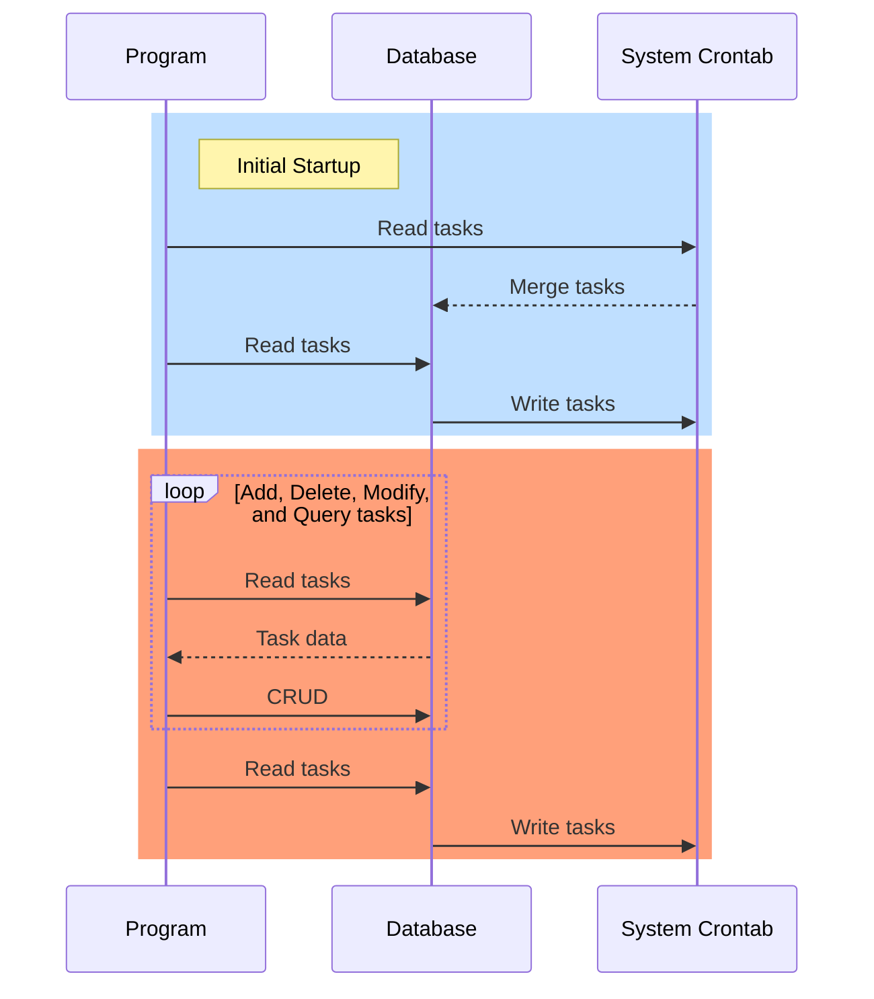

## Design Requirements
Based on the system's crontab command, implement the functionalities for managing scheduled tasks, including adding, deleting, modifying, and querying tasks.

To ensure the reliability and convenience of migrating data to a new host, the following requirements should be met:

- During the initial startup, the system tasks and the tasks in the database need to be merged and saved to the database, and then synchronized with the system's crontab.

- All task-related operations, such as adding, deleting, modifying, and querying, should be performed in the database first, and then synchronized with the system's crontab.

- Before performing any task-related operation, compare the tasks in the database with those in the system's crontab. If there are any differences, merge the task data before proceeding with the operation.

## SequenceDiagram

