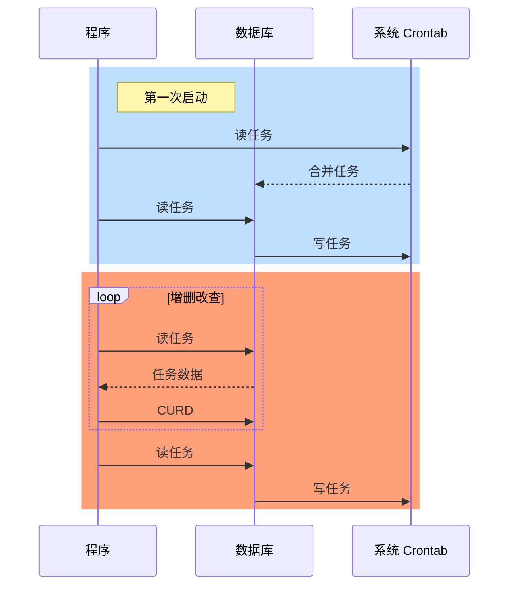

## 设计要求

本文档旨在实现基于系统的 crontab 命令的定时任务的增删改查功能。

以下是保证数据迁移至新主机可靠性和便捷性的要求：

- 首次启动时，需将系统任务与数据库中的任务合并，并保存至数据库，然后同步到系统的 crontab 中。
- 任务的增删改查操作均在数据库中进行，并随后同步到系统的 crontab 中。
- 在进行任务的增删改查操作前，需比对数据库中的任务与系统的 crontab 中的任务，若存在差异，则合并任务数据后再进行操作。

## SequenceDiagram（时序图）

